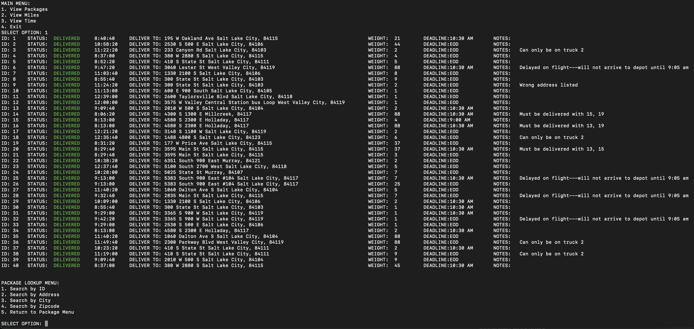

# Parcel Delivery Program

This repository contains the implementation of the SLCPS (Salt Lake City Parcel Services) Routing System. The program is
designed to efficiently route delivery trucks and ensure timely delivery of packages while adhering to specific constraints.

## Table of Contents
* [Technologies Used](#technologies-used)
* [Features](#features)
* [Screenshots](#screenshots)
* [Project Status](#project-status)
* [Room for Improvement](#room-for-improvement)
* [Acknowledgements](#acknowledgements)
* [Contact](#contact)

## Technologies
- Python (ver. 3.7)

## Features
- Search package status by:
  - ID
  - Address
  - City
  - Zipcode
  
- View miles driven of each truck
- View time driven of each truck
  - Search a specific point in time

## Screenshots

### Main Menu

### View Packages Status

### View Miles Driven for Each Truck

### View Time Driven for Each Truck

## Project Status
-  In Progress
